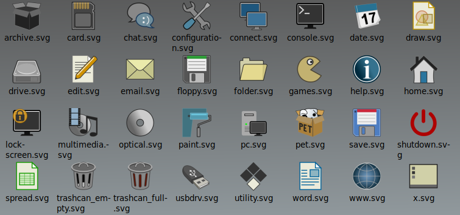

# puppy_icon_theme

Standard SVG icons for Puppy Linux (or other Linux).

These icons are derived from @zigbert 's work in woof-CE, with ideas
from @technosaurus .

## Preview

[](PuppyStandard.png)


## Build

First edit (if using a distro other than puppy) then "source" the `build.conf` file then run `make`.


```sh
. ./build.conf
make
```

The icons will be built in `"Puppy Standard"` directory.

To install just type `make install`. `DESTDIR` is supported.

Alternatively, just run the `build_theme` script from the current loacation
if you don't have `make`. The Makefile is just a convenience for packaging;
entirely not necessary.

## Artwork

I am no artist! ( @01micko ). Some of the icons could do with some (a lot?)
of work. Feel free to send in your pull requests but no icons built from InkScape 
or other SVG editors please.
